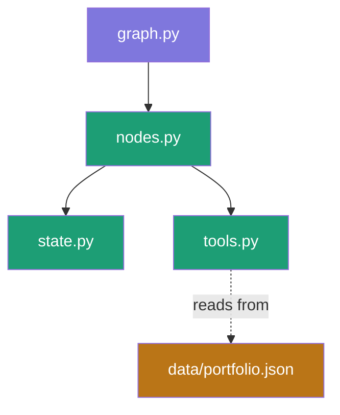
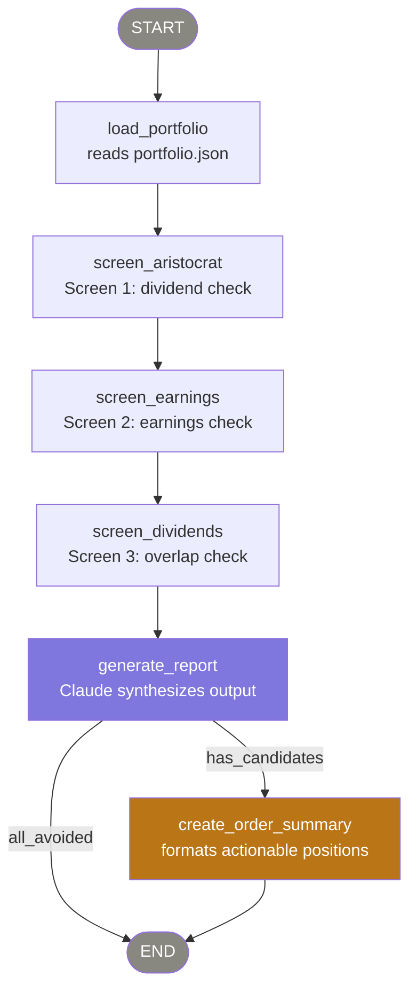

# options-income-advisor-agent

A LangGraph agent that analyzes a synthetic equity portfolio and recommends
covered-call and cash-secured-put opportunities for income generation.

Built as part of a LangSmith/LangGraph evaluation exercise using Anthropic's
Claude as the underlying LLM.

---

## Project Structure

```
options-income-advisor-agent/
├── .env.example                    # template for required env vars
├── .github/
│   └── workflows/
│       └── ci.yml                  # GitHub Actions CI pipeline
├── .python-version                 # pyenv pin (3.11.9)
├── pyproject.toml                  # poetry config and dependencies
├── poetry.lock                     # locked dependency versions
├── Makefile                        # common commands (install, run, lint, test, eval, dataset)
├── README.md                       # setup, architecture, and usage docs
├── FRICTION_LOG.md                 # developer experience notes for LangChain team
├── LICENSE
├── agent/
│   ├── __init__.py
│   ├── graph.py                    # LangGraph state machine — entry point
│   ├── nodes.py                    # node functions (load, screen, report, summary)
│   ├── state.py                    # AgentState and Position TypedDicts
│   └── tools.py                    # @tool definitions for screening logic
├── data/
│   └── portfolio.json              # synthetic portfolio dataset (5 positions)
├── evals/
│   ├── __init__.py
│   ├── dataset.py                  # creates LangSmith eval dataset (idempotent)
│   └── evaluate.py                 # SDK-based evaluate() with LLM-as-a-judge
├── notebooks/
│   └── exploration.ipynb           # scratch work and node prototyping
├── tests/
│   └── __init__.py                 # pytest test suite (placeholder)
└── docs/
    ├── adr/
    │   ├── ADR-001-python-version.md
    │   ├── ADR-002-poetry.md
    │   ├── ADR-003-anthropic.md
    │   ├── ADR-004-agent-domain.md
    │   ├── ADR-005-ci-cd.md
    │   ├── ADR-006-graph-topology.md
    │   └── ADR-007-langsmith.md
    └── images/
        └── langsmith-application-project-exists-error.png
```
---

## Architecture

### File Dependencies



### Graph Execution Flow




---

## Prerequisites

- [pyenv](https://github.com/pyenv/pyenv) — Python version management
- [Poetry](https://python-poetry.org/) 2.x — dependency management
- Python 3.11.9 (pinned via `.python-version`)
- Anthropic API key — [console.anthropic.com](https://console.anthropic.com)
- LangSmith API key — [smith.langchain.com](https://smith.langchain.com)

---

## Setup

**1. Clone the repo using SSH:**

```bash
git clone git@github.com:navarra-lisandro/options-income-advisor-agent.git
cd options-income-advisor-agent
```

**2. Confirm Python version:**

```bash
python --version  # should show 3.11.9
# If not: pyenv install 3.11.9 && pyenv local 3.11.9
```

**3. Install dependencies:**

```bash
poetry install
```

**4. Configure environment variables:**

```bash
cp .env.example .env
# Edit .env and add your API keys
```

**5. Activate the virtual environment:**

```bash
poetry shell
```

---

## Environment Variables

| Variable              | Description                                          |
|-----------------------|------------------------------------------------------|
| `ANTHROPIC_API_KEY`   | Anthropic API key from console.anthropic.com         |
| `LANGCHAIN_API_KEY`   | LangSmith API key from smith.langchain.com           |
| `LANGCHAIN_TRACING_V2`| Set to `true` to enable LangSmith tracing            |
| `LANGCHAIN_PROJECT`   | LangSmith project name for this agent                |

---

## Development Tools

| Tool         | Purpose                                                              |
|--------------|----------------------------------------------------------------------|
| `pytest`     | Test runner for unit tests                                           |
| `ruff`       | Fast Python linter and formatter (replaces flake8 + black)          |
| `ipykernel`  | Jupyter kernel for exploratory prototyping within the Poetry venv   |

---

## Architecture Decision Records

See [`docs/adr/`](docs/adr/) for documented design decisions covering
Python version selection, package management, LLM provider choice,
and agent domain rationale.

---

## Friction Log

See [`FRICTION_LOG.md`](FRICTION_LOG.md) for developer experience notes
captured during setup and development.
